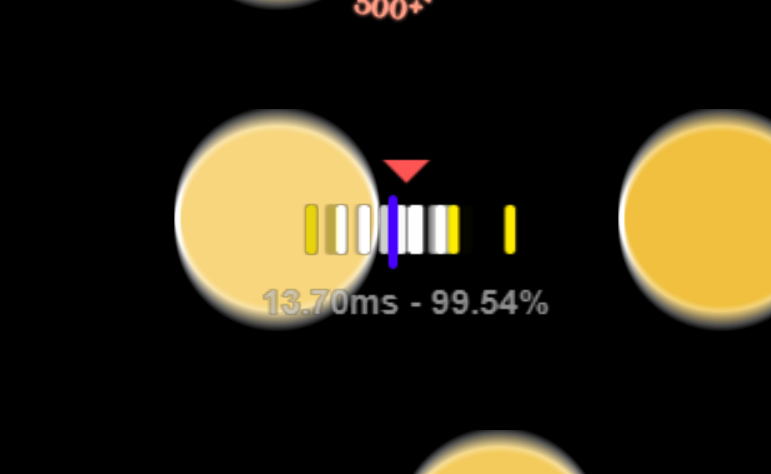

# custom hit error bar

A customized hit error bar for [osu!](https://osu.ppy.sh) mania  
developed specifically for [tosu](https://github.com/kotrikd/tosu) as an ingame overlay
basically a remastered version of [2ky's hiterror bar](https://github.com/2222zz/gosumemory-theme/tree/main/mania_simple_hiterror_colorful/)

displays hiterror, standard deviation, and accuracy

## how to install

1. download the .zip
2. extract .zip to your counters/overlays folder
3. set overlay url to the one provided in the tosu dashboard